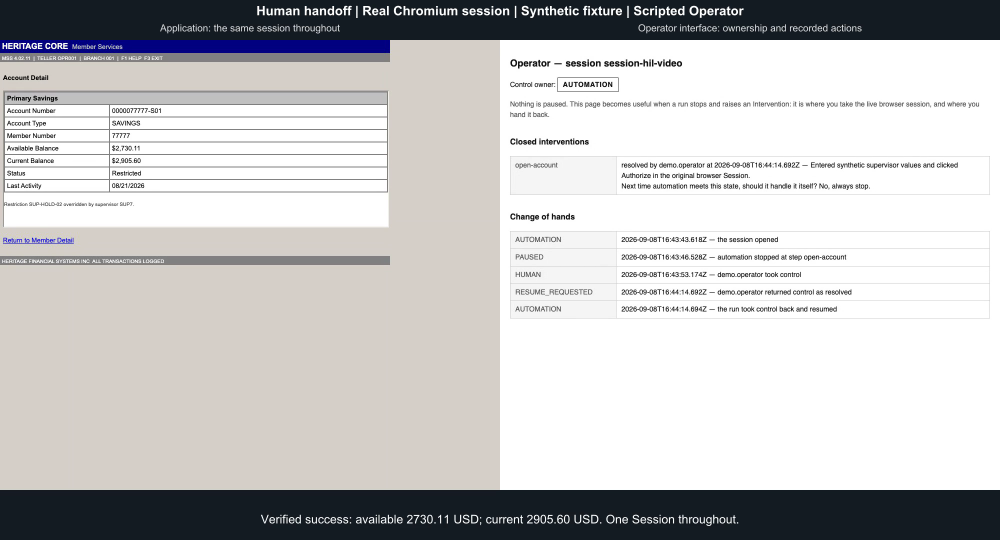

# Computer-use automation coding exercise

This repository is my solution to interface.ai's engineering take-home assignment,
"Computer-Use Automation System." The assignment asks for a system that uses a
language model to complete a task through an application's UI, records the
successful flow as a reusable capability, then replays it without model decisions.
It also asks for explicit error handling, safety rules, evidence and human
takeover of the live session. It leaves the target application and architecture
to the candidate.

I chose to build a backend automation system and a fictitious banking application
to test it against. I configured that application for two fictional institutions,
Heritage Core and Community CU, with different branding, control labels and
account layouts. Both tenants run the same application code. The automation
operates their interfaces through real Chromium.

The example task is to find a member, open their savings account and return the
available and current balances. All institutions, members, accounts and
credentials in the demo are synthetic.

Start with the local demo below. The [recorded proof](#proof-that-it-works) includes
a genuine model-driven discovery run, its compiled capability, later replays and
a video of the handoff mechanism. [REPORT.md](REPORT.md) explains the design choices
under the assignment's required headings.

## Run the demo

Install [Bun](https://bun.sh) 1.4 or later and Chromium:

```bash
bun install --frozen-lockfile
bunx playwright install chromium
```

Then run:

```bash
bun run demo
```

No database, container or separately running application is required. The demo
starts local application instances on available ports and prints its results and
evidence paths. It walks through discovery, repeated replay, business outcomes,
recovery, handoff, learning, optional model assistance, tenant reuse and a scan of
its text evidence for known private values.

The demo uses scripted discovery decisions and scripted operator actions so it
can run without an API key. Chromium, the application, replay engine and session
transfer are real. If `OPENAI_API_KEY` is set, the optional assistance step may
call the provider. To run the whole demo without model access:

```bash
env -u OPENAI_API_KEY bun run demo
```

Each run replaces `evidence/demo/`. Save anything you want to keep there before
running it again. The retained proof bundles elsewhere in `evidence/` stay intact.

For a single balance lookup:

```bash
bun run replay member.account-balance --memberId 12345 --json
```

The expected savings balances are `4182.55 USD` available and `4382.55 USD` current.
Add `--headed` to watch the browser. Ordinary replay does not need a model key.

## The fictional banking system

The banking application imitates an older back-office member-services system.
Both tenants follow the same flow: member search, member detail, account selection,
then account detail. The pages use server-rendered HTML, nested tables,
near-duplicate field names and complete page reloads. Heritage Core displays balances
in an unnamed iframe; Community CU displays them inline. There are no test IDs
or application API shortcuts for the automation.

These choices make target selection matter. The search page has a second,
misleading member-number field. A member can have two accounts that both match
"Savings." Reaching the account page does not prove the balance panel has loaded.
The automation must check the screen after each step before it can report success.

I created two tenant configurations of the same fictional vendor product.
They share the synthetic member book and demonstrate UI configuration differences.

| Configuration | Heritage Core | Community CU |
| --- | --- | --- |
| Tenant key | `heritage-core` | `community-cu` |
| Member field | Member Number | Member # |
| Search button | Search | Find |
| Savings label for member `12345` | Primary Savings | Regular Savings |
| Checking label for member `12345` | Checking | Share Draft |
| Balance panel | Inside an unnamed iframe | Inline on the account page |

The adapter handles the member-field variation and the inline balance panel.
Account selection matches the caller's words against the live account labels, so
"Savings" still finds "Regular Savings." It does not guess that "Find" means
"Search." That mismatch stops replay until a confirmed
[tenant override](config/tenant-overrides/community-cu/member.account-balance.yaml) supplies the
replacement button name. The override names its base capability version, `1.2.0`,
and leaves that shared artifact unchanged.

To browse both installations, run these in separate terminals:

```bash
bun run app
```

```bash
PORT=4174 bun run app --tenant community-cu
```

Open [Heritage Core](http://localhost:4173) and [Community CU](http://localhost:4174).
Search for member `12345` and compare the screens. Stop each server with Ctrl+C.

To replay against Community CU with its saved override:

```bash
bun run replay member.account-balance --memberId 12345 --tenant community-cu
```

The [tenant definitions](apps/banking/src/tenants.ts) and
[member records](apps/banking/src/members.ts) contain the fixture data.

## Try the exceptional states

The synthetic members exercise different answers to the same balance request.
Run `bun run replay member.account-balance --memberId <number>` with these values:

| Member | What replay encounters | Expected result |
| --- | --- | --- |
| `12345` | One savings account | Returns both balances |
| `22222` | Savings has a different label | Returns both balances without an override |
| `33333` | Two savings accounts match | Stops with `AMBIGUOUS_MATCH` |
| `55555` | System Busy interstitial and delayed balance panel | Uses bounded recovery, then returns balances |
| `77777` | Supervisor hold | Requests human intervention |
| `88888` | Checking account only | Returns `NO_MATCHING_ITEM` |
| `99999` | No member on file | Returns `MEMBER_NOT_FOUND` |

Success and known business outcomes exit with code 0. Failures and unresolved
interventions exit with code 1. A missing member is an answer to the lookup;
an ambiguous account selection needs attention.

You can also request checking or simulate session expiry:

```bash
bun run replay member.account-balance --memberId 12345 --accountType Checking

bun run replay member.account-balance --memberId 12345 \
  --operatorPassword HERITAGE --expireSessionAfter 2

bun run replay member.account-balance --memberId 12345 --expireSessionAfter 2
```

`HERITAGE` is the fixture's synthetic teller password. With it, the declared
recovery signs back in and resumes the interrupted flow. Without it, recovery
cannot complete.

## Take over the live browser

```bash
bun run demo:handoff
```

This opens Chromium and requests the balance for member `77777` using capability
version `1.1.0`, which predates the learned supervisor hold. When replay pauses:

1. Open the complete operator URL printed in the terminal, including its token.
   Enter your name and choose "Take control of this session."
2. Switch to the existing Google Chrome for Testing window. In the held account
   panel, enter `SUP7` for Supervisor ID and `4417` for Authorization Code, then
   click "Authorize." These are synthetic demo values.
3. Return to the operator page, describe the action and check "I changed the live
   session." Say the screen is ready to resume and that automation should always
   stop and ask a person next time. Choose "Return control."

Replay checks the returned screen and should report `2730.11 USD` available and
`2905.60 USD` current. Automation cannot act while the operator owns the session.
Returning control without releasing the hold does not pass the checkpoint.

The demo uses the original browser session throughout. It includes `--noAmend`,
so practicing the handoff does not save a new capability version. The
[full walkthrough](docs/human-handoff.md) also covers an unresolved return and the
automated acceptance checks.

## Discover a capability with a real model

Set `OPENAI_API_KEY` in your shell, then run:

```bash
bun run discover "Look up the savings account balance of member 12345" \
  --model gpt-4.1 --headed \
  --emit member.account-balance.local --artifactVersion 1.0.0

bun run replay member.account-balance.local --version 1.0.0 --memberId 12345 --json
```

Run replay after discovery succeeds. Discovery calls the model, drives Chromium
and compiles the observed flow into a YAML capability under `config/capabilities/`.
The retained live run used `gpt-4.1`; a fresh model run can choose different steps
or fail to compile. Artifact versions are immutable, so use a new name or version
when repeating the command.

To inspect the checked compilation output before storing it, use the separate
commands instead:

```bash
bun run discover "Look up the savings account balance of member 12345" \
  --model gpt-4.1 --json > checked-run.json

bun run compile checked-run.json --capability member.account-balance.inspected

bun run replay member.account-balance.inspected --memberId 12345 --json
```

Only compile after discovery exits successfully. `discover --json` writes a
checked compilation envelope to standard output and status to standard error.
Discovery checks private values while they are still in memory. `compile`
validates that envelope's artifact and assigns its public name; it does not accept
a raw model transcript. The envelope is not signed or evidence of reviewer approval.

A successful discovery only teaches the flow it observed. It does not invent
handling for a missing member or a supervisor hold. Recorded, confirmed
interventions can add business outcomes, mark states as requiring a person or
produce a tenant override. Existing artifact versions cannot be overwritten.

The shipped `member.account-balance` capability began as a handwritten reference.
`member.account-balance.discovered` preserves the model-discovered flow and its
later amendments. To invoke the final recorded version:

```bash
bun run replay member.account-balance.discovered --version 1.8.0 --memberId 12345
bun run replay member.account-balance.discovered --version 1.8.0 --memberId 99999
bun run replay member.account-balance.discovered --version 1.8.0 --memberId BAD-INPUT
```

Those return success, `MEMBER_NOT_FOUND` and `INPUT_VALIDATION_ERROR`, respectively.

Other useful options are `--json`, `--headed`, `--version <version>`,
`--policy <name-or-path>` and `--baseUrl <url>`. An external application's origin
must be allowed by the selected policy. Add `--handoff` to discovery or replay to
expose the local operator interface when the run needs help.

## How the automation works

The implementation uses TypeScript, Bun, Effect 4 release candidate, Playwright
and Chromium. One process owns a run, and files hold the capabilities and evidence.
That is enough to demonstrate the assignment's complete path without a queue or
distributed session service.

1. Discovery reads the accessibility tree and asks the model for an action.
   Policy checks the action before the browser executes it. Step limits, time
   limits and stuck-state detection bound the loop.
2. Compilation turns the successful run into a typed YAML capability. It declares
   inputs, outputs, ordered steps, target descriptions, targeting rationale and
   checkpoints. Member identifiers become parameters rather than saved literals.
3. Replay follows the saved steps without model decisions. It finds controls in
   the current accessibility tree and checks each resulting state. It returns
   typed outputs, a declared business outcome, a failure or an intervention request.
4. Recovery tries declared remedies within their limits. Optional `--assist`
   can consult a model to classify a stopped state; it cannot let the model act.
   Human handoff transfers ownership of the original session and checks the
   screen again before automation continues.

The capability describes controls by role, name, caption and region. Browser
references and CSS selectors stay out of it. The surface adapter owns the details
of observation and action, including frames. Desktop execution is a documented
extension of that boundary, not an implemented adapter.

| Assignment section | Implementation to inspect |
| --- | --- |
| 3.1 Goal-driven loop | [Discovery](packages/agent/src/discovery.ts) and [agent loop](packages/agent/src/loop.ts) |
| 3.2 Structured capability | [Artifact schema](packages/artifact/src/CapabilityArtifact.ts) and [compiled example](config/capabilities/member.account-balance.discovered/1.5.0.yaml) |
| 3.3 Replay and errors | [Replay engine](packages/replay/src/engine.ts), [result contract](packages/replay/src/ReplayResult.ts) and [checkpoints](packages/replay/src/checkpoint.ts) |
| 3.4 Safety and policy | [Default policy](config/policies/default.yaml), [text redaction](packages/evidence/src/Scrub.ts) and [learning checks](packages/replay/src/learning.ts) |
| 3.5 Evidence | [Evidence writer](packages/evidence/src/EvidenceWriter.ts) and the proof bundles below |
| 3.6 Human handoff | [Operator walkthrough](docs/human-handoff.md) and [acceptance tests](test/human-handoff-acceptance.test.ts) |
| 3.7 Heterogeneity and tenant reuse | [Adapter contract](packages/surface/src/SurfaceAdapter.ts), [tenant tests](test/second-tenant-and-discovered-override.test.ts) and [design report](REPORT.md#heterogeneity--multi-tenant) |

## Proof that it works

The repository retains separate evidence for live discovery, repeatable tests and
operator handoff. Each proves a different part of the exercise.

| Evidence | What it establishes |
| --- | --- |
| [Live discovery bundle](evidence/discovery/live-2026-09-08T14-45-52-190Z-132a40d2/manifest.json) | A genuine `gpt-4.1` run drove the application and compiled version `1.5.0`. The manifest links the artifact hash to a successful replay returning both balances. |
| [Discovery completion and learning](evidence/discovery/live-2026-09-08T14-45-52-190Z-132a40d2/completion-2026-09-08T14-46-08-572Z-9d350a19/manifest.json) | Recorded interventions produced versions `1.6.0` through `1.8.0`. Final replays cover success, no matching account, missing member and invalid input. Operator decisions in these learning runs are scripted. |
| [PR review verification](evidence/verification/2026-09-08-pr-review/README.md) | The September 8 report records 553 passing tests across 56 files and a passing typecheck. Its source manifest identifies the tested files. |
| [Architecture and handoff verification](evidence/verification/2026-09-08-architecture/README.md) | An earlier 547-test run, the eight-act demo without a model key, completed and blocked handoffs, and a separate agent-operated native UI run. |
| [Tenant evidence](evidence/tenant/community-cu/) | The second tenant fails without its override, succeeds with it and leaves the shared capability unchanged. Model proposals and operator confirmation in this demonstration are scripted. |

[](https://github.com/user-attachments/assets/bd44bf29-4424-434d-be28-df105e95caa3)

The [40-second video](https://github.com/user-attachments/assets/bd44bf29-4424-434d-be28-df105e95caa3)
shows the banking application beside the operator form. Scripted operator actions
release the hold in the same browser session, return control and allow replay to
read both balances. The [receipt and event logs](evidence/verification/2026-09-08-handoff-video/README.md)
identify the source revision and record ownership changes. The accompanying
verifier checks session continuity, refusal of competing replay and the
checkpoint after control returns. It also rejects six altered evidence cases.

Run the checks yourself:

```bash
bun run typecheck
bun run test
bun run verify:handoff
bun evidence/verification/2026-09-08-handoff-video/verify.mjs
```

The full test suite includes browser integration tests against real Chromium.
The test command reports the current counts; retained reports describe their
recorded source versions. Scripted model tests do not establish live discovery.
That proof is in the model-driven bundle linked above.

To generate another live discovery and replay bundle with an API key:

```bash
bun run apps/demo/src/support/drive-the-discovery-run.ts
```

The driver refuses artifact and evidence collisions. If a later verification
stage fails, `--resume <bundle-directory>` verifies the saved artifact and its
compilation receipt before appending a completion attempt. Generated evidence
is normally gitignored; retained submission bundles were explicitly added.
Historical logs and receipts retain their recorded paths and hashes. The
[evidence index](evidence/README.txt) maps those paths to the current layout.

## Safety boundaries and remaining work

Policy allows configured origins and action types. The browser checks frame
origins, network destinations and redirects. Risky actions require a written
justification. The shipped `read-only` policy allows navigation and extraction,
so it refuses even the first fill in a member search.

Text evidence and learned documents scrub known private values. Binary capture
is disabled by default. Local fixture commands explicitly allow unredacted
screenshots of synthetic data; external `--baseUrl` runs retain scrubbed
accessibility evidence without screenshot bytes. Text scans cannot check pixels.
[ADR-0010](docs/adr/0010-evidence-screenshots-are-not-redacted.md) explains this limit.

This exercise does not implement screenshot masking, route-level policy,
universal secret detection, production authentication for the fictional bank,
desktop execution, remote co-browsing, production storage or an artifact approval
service. Two tenant configurations demonstrate reuse; they do not prove operation
across hundreds of institutions. [REPORT.md](REPORT.md) describes the extension
points and tradeoffs.

## Find your way around the repository

`apps/` contains runnable programs, and `packages/` contains the automation code
those programs share. `config/` holds saved capabilities, tenant overrides and
policies. Tests, documentation and recorded proof each have their own directory.

| Path | Contents |
| --- | --- |
| `apps/cli/` | Discovery, compilation and replay commands |
| `apps/banking/` | Fictional banking application, tenants and member data |
| `apps/operator/` | Local interface for taking and returning control |
| `apps/demo/` | Demo entry point, helpers and evidence drivers |
| `packages/agent/` | Discovery loop, compiler, model provider and assisted classification |
| `packages/replay/` | Replay, checkpoints, recovery and learning |
| `packages/surface/` | Accessibility observation, target resolution and browser actions |
| `packages/artifact/` | Capability schema, version storage and amendments |
| `packages/session/` | Session ownership and interventions |
| `packages/policy/` | Allowed actions, origins and sensitivity rules |
| `packages/evidence/` | Structured events and text redaction |
| `config/capabilities/` | Saved, versioned automation flows |
| `config/tenant-overrides/` | Confirmed changes for a specific tenant |
| `config/policies/` | Allowed origins, actions and data handling rules |
| `test/` | Automated checks |
| `docs/` | Glossary, specification, handoff guide and architecture decisions |
| `evidence/` | Retained runs, receipts, logs and verification reports |

[The glossary](docs/glossary.md) defines the project vocabulary.
[The specification](docs/specification.md) records the original implementation plan.
[docs/adr/](docs/adr/) records the architecture decisions.
